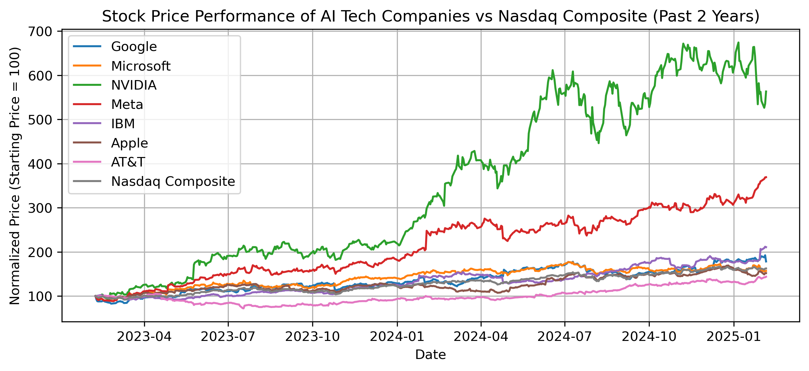
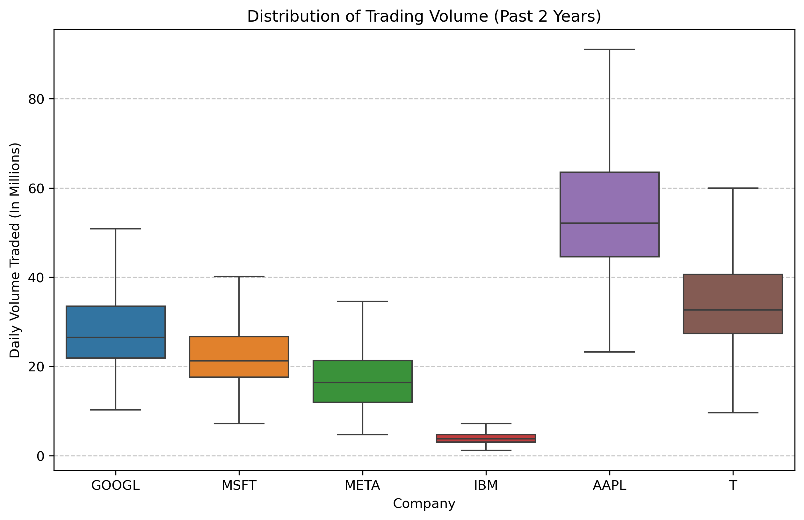
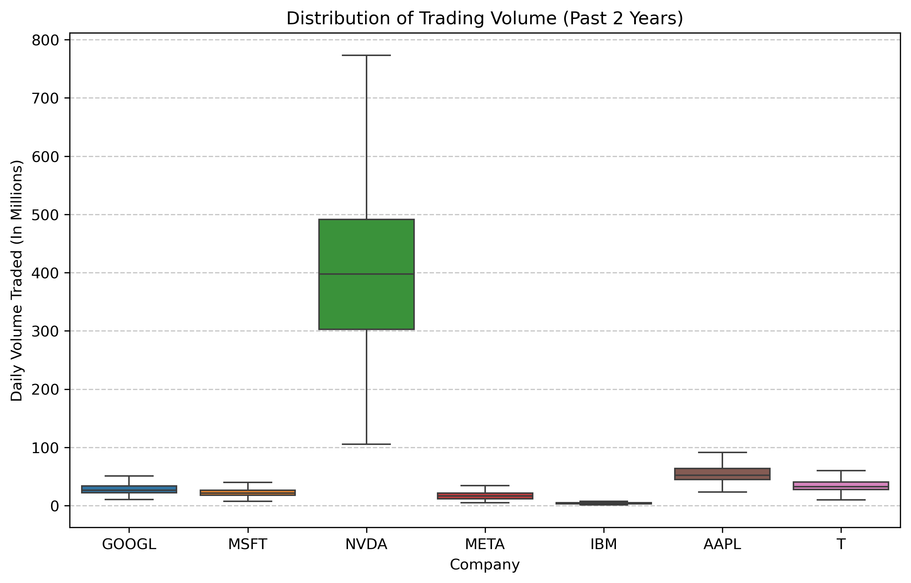
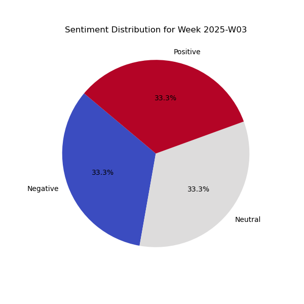
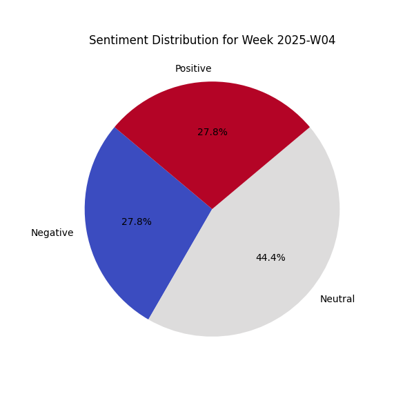
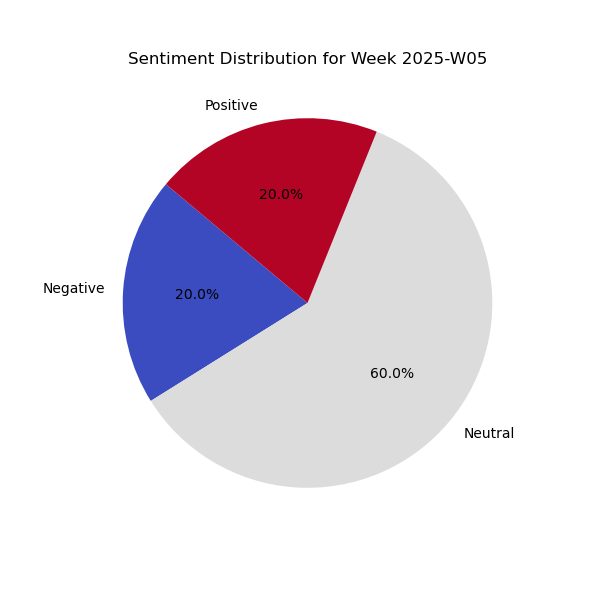
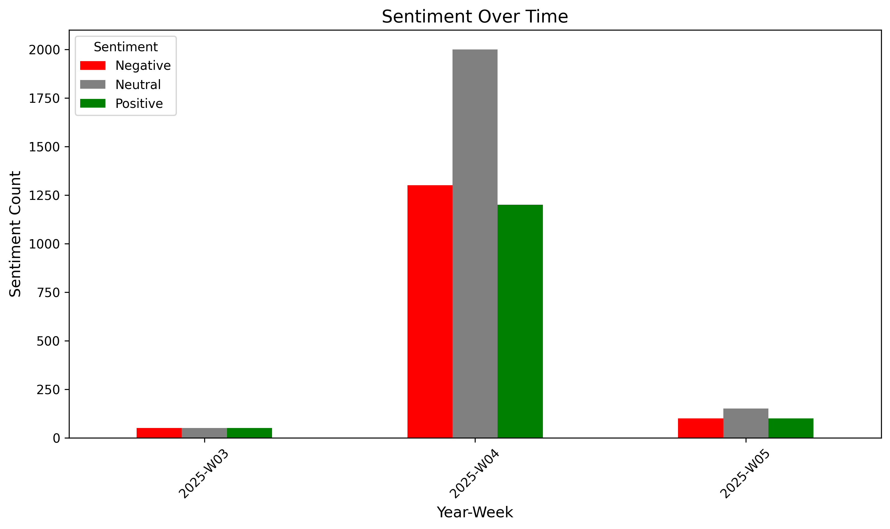

# Analyzing Deepseek's Influence on the AI Market: A Public Perception and Stock Market Perspective

This project investigates Deepseek's influence within the AI market by examining public perception, stock market performance, and the interplay between the two.  It aims to understand how Deepseek is perceived by the public, how its presence and advancements impact investor sentiment, and whether these factors correlate with stock market activity in the AI sector.

## Team Members

* Alex Ivanoff 
* Brynn Butler
* Noah Schmidt
* Pojanart Foote
* Stephenie Fritz

## Deepseek Background
Deepseek is a Chinese artificial intelligence company specializing in large language models (LLMs) and other advanced AI technologies.  They have gained recognition for their development of DeepSeek Chat, a competitive LLM, and are actively involved in research and development within the rapidly evolving AI landscape.  Deepseek's emergence as a significant player in the AI field has the potential to reshape market dynamics and influence the competitive landscape, making it a subject of interest for investors and the public alike.

## Project Goals
This project seeks to:
* Quantify and compare the stock price performance of key AI companies relative to the Nasdaq benchmark.
* Analyze public sentiment towards Deepseek as expressed in news articles, identifying prevalent themes and topics.
* Investigate the correlation between Deepseek's activities and both investor sentiment and stock market reactions.

## Research Questions
This project aims to answer the following key questions:
1. **Stock Price Performance:** How have the stock prices of selected AI tech companies (including Google and Microsoft) performed compared to the Nasdaq Composite Index over the past two years?  This analysis will quantify relative performance and identify key trends and fluctuations.
2. **News Sentiment Surrounding Deepseek:** What is the overall sentiment (positive, negative, neutral) surrounding Deepseek in news articles?  This analysis will explore public perception of Deepseek as expressed in news articles. 
3. **Deepseek's Influence:** How has DeepSeek’s entrance and technological advancements influenced investor sentiment and stock performance in the AI sector?  This analysis will investigate potential correlations between Deepseek's activities and market reactions, including stock price movements and changes in news sentiment.

## Datasets
This project utilizes the following datasets to investigate Deepseek's influence on the AI market:
1. **News Article Data:** A collection of 5,000 news articles mentioning Deepseek will be used to analyze public sentiment and identify key themes and topics associated with the company. These articles will be sourced from Google News using the SerpAPI. This service allowed us to retrieve news articles from Google News within a specified date range (mention the date range if relevant). The news data will include the full article text, headline, publication date, and source. (Mention specific news outlets if applicable, e.g., "including tech publications like TechCrunch and VentureBeat.")

2. **Stock Market Data:** Historical stock market data for the past two years will be used to analyze the performance of selected AI tech companies relative to the Nasdaq Composite Index, including the distribution of daily trading volume. The dataset includes daily stock prices (Open, High, Low, Close) and trading volume for the following companies:
    * Google (GOOGL/GOOG)
    * Microsoft (MSFT)
    * NVIDIA (NVDA)
    * Meta (META)
    * IBM (IBM)
    * Apple (AAPL)
    * AT&T (T)
    * Nasdaq Composite (^IXIC)

The stock price data will be used to investigate potential correlations with Deepseek's announcements and news sentiment.  The trading volume data will be analyzed to understand the level of market interest and activity associated with each company's stock, and potential correlations with price movements and Deepseek's activities.

## Methods
This project employed a combination of data collection and analysis techniques to investigate Deepseek's influence on the AI market.

**Data Collection**
* **News Data API:** News articles mentioning Deepseek were collected using the SerpAPI. This service allowed us to access and parse Google News results for a specified date range. 
* **Stock Market Data:** Historical stock price and trading volume data for selected AI tech companies (Google, Microsoft, NVidia, Meta, IBM, Apple, AT&T) and the Nasdaq Composite Index were downloaded using the `yfinance` library in Python. The data covers a two-year period.

**Data Analysis**
* **Sentiment Analysis:** The sentiment of news articles was analyzed using the `vaderSentiment` library's `SentimentIntensityAnalyzer`.  News articles mentioning Deepseek were analyzed to determine the overall sentiment (positive, negative, neutral) expressed in the text.  This tool is specifically designed for analyzing sentiment in social media text and short phrases, making it suitable for news headlines and snippets. 
* **Stock Market Analysis:** Stock price data was processed using the `pandas` library. We calculated returns and performed statistical analysis to compare the performance of AI tech companies relative to the Nasdaq.
* **Statistical Analysis:** To investigate potential relationships between Deepseek's activities and market data, we utilized the `statsmodels` library in Python. 
* **Visualization:** Data visualizations were created using `matplotlib` libraries in Python.

# Analysis
## Stock Price Performance Analysis (Past 2 years)

This analysis of normalized stock prices over two years reveals a striking divergence in performance among key AI tech companies compared to the Nasdaq Composite.  NVIDIA's exceptional growth significantly outpaces all others, likely reflecting its dominant role in the AI chip market and its perceived central importance to AI advancements.  While the Nasdaq shows a general upward trend, other AI companies exhibit mixed results, suggesting varying degrees of success in capitalizing on the AI boom. Google and Microsoft demonstrate growth somewhat aligned with the benchmark, albeit with periods of both outperformance and underperformance, indicating their established presence but also highlighting the competitive landscape.  Meta displays a notable upward trend, potentially signaling positive investor sentiment related to its AI ventures, while IBM, Apple, and AT&T show more modest growth, suggesting less direct exposure or perhaps a more diversified business focus beyond core AI.

The diverse performance within the AI sector underscores the complexity of this dynamic market.  NVIDIA's dramatic rise highlights the importance of its crucial role in AI development, while other companies' more moderate growth suggests a less direct correlation with the AI boom or a more balanced portfolio approach.  The varying degrees of volatility also point to differing risk profiles and market sensitivities.  NVIDIA's stock price, while showing the highest growth, also appears to experience more significant fluctuations, implying greater potential for both gains and losses.

Further research, including quantitative measures of returns and volatility, alongside analysis of company-specific events, industry trends, and broader market conditions, is crucial for a more in-depth understanding of the factors driving these stock price trends.  While this analysis reveals correlations, it's important to note that causation cannot be definitively established without further investigation.  Examining trading volume data and news sentiment related to these companies could also provide valuable insights into investor behavior and market perceptions.

## Percentage Change in Stock Price Analysis (Past 2 Years)

This analysis examines the two-year stock price performance of selected AI tech companies (Google, Microsoft, NVIDIA, Meta, IBM, Apple, and AT&T) relative to the Nasdaq Composite Index (^IXIC). Utilizing percentage change in stock price as the key metric, the analysis highlights the diverse growth trajectories and relative performance of these companies within the dynamic AI sector over this extended timeframe.

The bar chart vividly illustrates the stark contrast in stock performance.  NVIDIA (NVDA) emerges as the clear frontrunner, boasting an extraordinary percentage increase far exceeding all other analyzed companies and the Nasdaq benchmark. This exceptional growth likely reflects investor confidence in NVIDIA's dominant position within the AI chip market and its crucial role in enabling AI development.  Meta (META) also demonstrates substantial growth, though significantly less pronounced than NVIDIA, potentially indicating positive investor sentiment related to its AI ventures and broader business strategies.  Google (GOOGL) and IBM (IBM) exhibit more moderate growth, while Microsoft (MSFT), Apple (AAPL), and AT&T (T) show relatively modest increases, suggesting a less direct correlation with the booming AI sector or a more diversified business focus.  The Nasdaq Composite itself demonstrates growth, but is clearly outpaced by several of the selected AI companies, most notably NVIDIA.

The wide range of performance underscores the multifaceted nature of the AI market and the various factors influencing stock prices.  NVIDIA's dramatic outperformance highlights the potential rewards associated with its specialized focus and critical role in the AI ecosystem. Meta's substantial growth indicates positive investor sentiment, likely driven by a combination of AI initiatives and other business factors.  The more moderate growth of Google and IBM, and the relatively modest increases of Microsoft, Apple, and AT&T, emphasize the complex interplay of forces shaping stock prices, including company-specific developments, broader tech sector trends, and overall market conditions.  It's important to note that this analysis focuses on percentage change and doesn't directly reflect absolute dollar value changes or account for factors like stock splits or dividends.  Further investigation, including analysis of volatility, trading volume, and specific news events related to each company, would provide a more nuanced understanding of the observed trends.

## Trading Volume Distribution Analysis (Past 2 Years)

This analysis examines the distribution of daily trading volume over the past two years, utilizing box plots to visualize key statistical measures. Understanding the typical trading volume and its variability is crucial for gauging market interest, liquidity, and potential reactions to news or events related to these companies.

The box plots reveal significant differences in both the median trading volume and the range of trading activity across the selected companies.  AAPL and T exhibit notably higher median trading volumes compared to the others, suggesting consistently higher market interest and liquidity.  GOOGL and MSFT demonstrate moderate median trading volumes, while META shows a comparatively lower median.  IBM stands out with a remarkably low median trading volume, indicating considerably less trading activity relative to the other companies.  The variability in trading volume, represented by the interquartile range (IQR) and the whiskers, also differs across the companies.  While AAPL and T show moderate variability, GOOGL and MSFT exhibit slightly higher fluctuations.  META's trading volume appears less variable, and IBM's shows very low variability, consistent with its low median volume.

The observed variations in trading volume likely reflect differences in market capitalization, investor base, and the types of news and events that typically impact each company.  The higher trading volumes for AAPL and T are consistent with their status as large, well-established companies with a broad investor base.  The moderate volumes for GOOGL and MSFT suggest significant, but perhaps less frequent trading activity.  META's lower volume might reflect its specific market positioning and investor perceptions about the company's future direction.  IBM's significantly lower trading volume is notable and could be due to factors such as lower investor interest or a more stable investor base.  Further analysis correlating trading volume with price movements and news events would provide a more comprehensive understanding of market dynamics and investor behavior related to these companies.

## Trading Volume Distribution Analysis including NVDA (Past 2 Years)

This analysis examines the distribution of daily trading volume over the past two including NVIDIA (NVDA). The inclusion of NVIDIA (NVDA) in this analysis is particularly important given its prominent role in the AI chip market and its potential impact on trading dynamics within the tech sector.

The box plots reveal a dramatic disparity in trading volume, with NVIDIA (NVDA) exhibiting a vastly higher median and significantly greater range of trading activity compared to all other companies. This stark contrast highlights the intense market focus and trading activity centered around NVDA, likely driven by its leading position in the AI chip market and the associated investor interest. 

NVIDIA's exceptionally high trading volume underscores its perceived importance and market sensitivity within the AI sector.  This intense trading activity likely reflects investor reactions to news, product announcements, and broader trends impacting the AI chip market.  The significant variability in NVDA's trading volume also suggests a higher degree of market responsiveness and potential volatility in its stock price.  Further analysis correlating NVDA's trading volume with its price movements, news events, and specific announcements would provide a more comprehensive understanding of market dynamics and investor behavior related to this key player in the AI landscape.  The trading volumes of the other listed companies, while varying among themselves, are dwarfed by NVDA's activity, highlighting the unique market position and investor focus on this dominant force in AI hardware.

## Stock Price Performance Analysis (Past 30 Days)

This analysis examines the short-term stock price performance of selected AI tech companies (Google, Microsoft, NVIDIA, Meta, IBM, Apple, and AT&T) relative to the Nasdaq Composite Index over a 30-day period. Utilizing a normalized price index (starting at 100), the analysis focuses on relative growth and fluctuations within this short timeframe, emphasizing the diverse reactions of these companies to market dynamics and potentially company-specific news.

The 30-day window reveals distinct performance patterns, highlighting the varying sensitivities of these AI-related stocks. NVIDIA exhibits the most pronounced volatility, with significant price swings, ultimately concluding the period with a decrease. This suggests a strong responsiveness to short-term market sentiment and perhaps news or announcements specific to the company or the AI chip market. In contrast, Google and Microsoft demonstrate relatively stable performance, fluctuating modestly around the normalized starting point, indicating more consistent market behavior during this period. Meta displays a general upward trend, possibly reflecting positive investor sentiment related to its AI ventures. IBM shows a largely flat performance, while Apple and AT&T experience some fluctuations and end the period with a decrease, suggesting mixed reactions to market forces or company-specific developments.

The observed variations in short-term performance underscore the dynamic nature of the AI sector and the multitude of factors influencing stock prices. While NVIDIA's volatility suggests a higher risk profile and sensitivity to market sentiment, the more stable performance of Google and Microsoft points to their established market presence and potentially less direct impact from short-term AI-specific news.  Meta's upward trend highlights the potential for positive investor perception of AI-related initiatives, while the mixed performance of other companies suggests a complex interplay of factors beyond just AI.  It's crucial to acknowledge the limitations of this short-term analysis and recognize that these 30-day trends may not be indicative of long-term performance or fundamental company strength. Further investigation, including analysis of trading volume, news sentiment, and company-specific events, would provide a more comprehensive understanding of the drivers behind these stock price movements.

## Sentiment Analysis
### News Sentiment Analysis Over Time

This analysis examines the evolution of news sentiment surrounding Deepseek over a three-week period in 2025 (W03, W04, W05).  Each news article was processed, and a compound sentiment score was generated using the Vader sentiment analyzer. Articles were classified as "positive," "negative," or "neutral" based on their compound sentiment scores.

The distribution of sentiment across news articles for weeks 3, 4, and 5 of 2025 is shown below: 
| Week       | Negative | Neutral | Positive |
|------------|----------| --------| ---------|
| 2025 - W03 |       50 |      50 |       50 |
| 2025 - W04 |      1300|    2000 |     1200 |
| 2025 - W05 |       100|     150 |      100 |

To assess whether the proportion of neutral articles varied significantly across these weeks, we performed a z-test for proportions. The results are as follows:
* **Week 4 vs. Week 3:** The p-value for the difference in the proportion of neutral articles is 0.0035. This indicates a statistically significant difference, suggesting that the proportion of neutral articles was higher in week 4 compared to week 3.
* **Week 5 vs. Week 4:** The p-value for the difference in the proportion of neutral articles is 0.7176. This indicates no statistically significant difference between these two weeks.

The significant increase in neutral articles in week 4 suggests a shift in media coverage, potentially reflecting broader or more nuanced reporting on Deepseek's activities. The lack of significant change between weeks 4 and 5 indicates that this shift in neutral coverage stabilized. 

We also utilized a stacked bar chart and pie chart to visualize the distribution of negative, neutral, and positive sentiment.  The stacked bar chart reveals a significant shift in sentiment distribution across the three weeks.  Week 3 shows a relatively balanced distribution, with a roughly equal count of negative, neutral, and positive articles.  However, week 4 exhibits a dramatic increase in both negative and neutral articles, while positive articles remain relatively constant.  This suggests a potential shift in media coverage, possibly reflecting increased scrutiny or a broader range of perspectives on Deepseek's activities.  By week 5, while the absolute counts are lower, the proportion of neutral articles remains dominant, indicating a sustained trend towards more balanced or objective reporting.  The noticeable increase in neutral sentiment between weeks 3 and 4, and its continued dominance in week 5, warrants further investigation into the specific events or news topics driving this shift.  Correlating these sentiment changes with Deepseek's announcements, product launches, or industry developments during this period would provide valuable context and a deeper understanding of the factors shaping public perception.

### Conclusion
This research explored Deepseek's influence on the AI market by examining stock price performance, trading volume, and news sentiment over time.  Our analysis revealed several key findings.  
* Firstly, NVIDIA's stock price and trading volume significantly outperformed other AI-related companies, highlighting its dominant position and investor focus within the AI chip market.  
* Secondly, news sentiment surrounding Deepseek shifted from a relatively balanced distribution in week 3 to a predominantly neutral stance in weeks 4 and 5, potentially reflecting increased scrutiny or a broader range of perspectives on Deepseek's activities.  However, it's important to note that the sentiment analysis covers a period that includes Deepseek's January 2025 announcement, limiting our ability to isolate the specific impact of this event.   
* Finally, while other AI companies exhibited varying degrees of stock performance and trading volume, none approached the magnitude of NVIDIA's activity, underscoring the unique market dynamics surrounding this key player.

### Limitations
This research has several limitations. The 30-day timeframe for stock price and sentiment analysis may not be representative of long-term trends. Specifically, the limited timeframe following Deepseek's January 2025 announcement restricts our ability to fully assess the announcement's impact on market sentiment and stock performance. The sentiment analysis, while informative, is based on a limited dataset of news articles and may not fully capture the breadth of public opinion.  Additionally, correlating Deepseek's activities with stock market reactions is challenging due to the multitude of factors influencing stock prices.  While we observed potential relationships, establishing definitive causality requires further investigation.  Finally, the selection of AI companies analyzed, while relevant, is not exhaustive and may not fully represent the entire AI landscape.

### Additional Analysis (Future Research)
With additional time, several avenues of research could enhance this analysis.  Expanding the timeframe for stock price and sentiment analysis, particularly extending the analysis further beyond the Deepseek announcement,  would provide a more comprehensive view of long-term trends.  Incorporating social media sentiment (e.g., from Twitter) could offer a more nuanced understanding of public perception.  A deeper dive into the specific news content driving sentiment changes, through topic modeling or thematic analysis, would provide valuable insights into the factors shaping public opinion about Deepseek.  Furthermore, exploring the competitive landscape and comparing Deepseek's performance and public perception to its direct competitors could provide a more contextualized assessment of its influence within the AI market.  Finally, a more rigorous statistical analysis, potentially including regression modeling, could help quantify the relationship between Deepseek's activities and market reactions, moving beyond observed correlations towards a more robust understanding of causality.

### References
* Google. (n.d.). *Google Search*. Retrieved from https://www.google.com/
* Statsmodels: https://www.statsmodels.org/stable/api.html
* SerpAPI. (n.d.). *Google News Search API*. Retrieved from [SerpAPI URL -  e.g., https://serpapi.com/google-news-api]
* Yahoo Finance. (n.d.). *Historical Stock Data*. Retrieved from [Yahoo Finance URL - e.g., https://finance.yahoo.com/]
* How to Use yfinance API with Python : https://www.geeksforgeeks.org/how-to-use-yfinance-api-with-python/
* How to write a good README for your GitHub project? [https://bulldogjob.com/readme/how-to-write-a-good-readme-for-your-github-project]
